## UAS Pemrograman Mobile

**Nama : Ramadhan Ardi Iman Prakoso**

**Kelas : TI. 22. A3**

**NIM : 312210722**

**Berikut Ini Adalah Hasil Project Pemrograman Mobile Dari Pertemuan 1 Sampai 15**

Berikut adalah hasil laporan aplikasi yang telah saya buat:

- Launcher Splash : Aplikasi ini mengeluarkan gambar logo kita.
  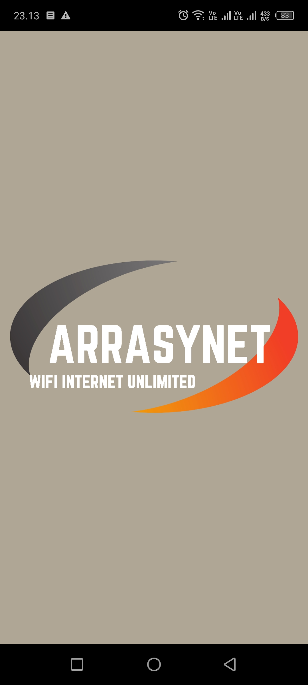

- Home Page : Aplikasi ini mengeluarkan tampilan menu.
  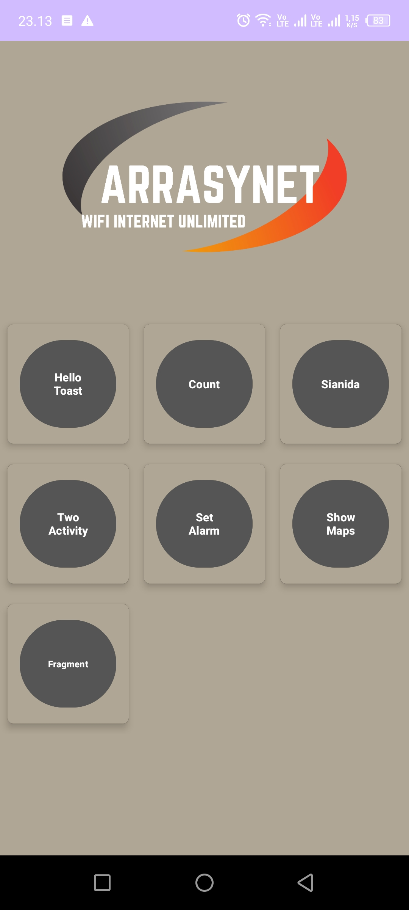

- Hello Toast : Aplikasi ini mengeluarkan text Bagaimana Kabar Anda Hari Ini.
  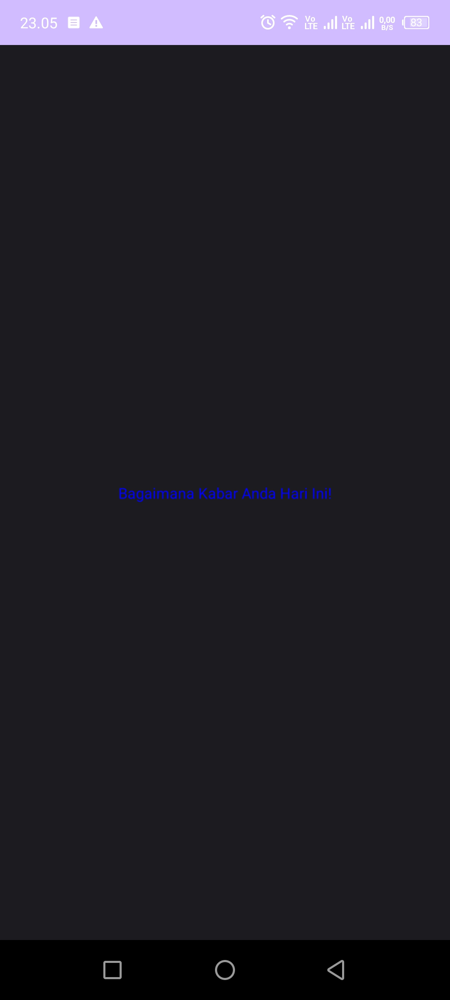

- Bilangan Fibonacci : Aplikasi ini dapat menghitung bilangan fibonacci, kita juga bisa menentukan maximum bilangannya, dan juga bisa mereset ulang bilangannya.
  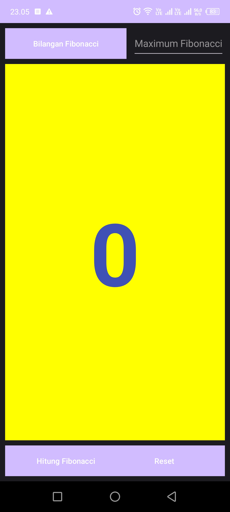
  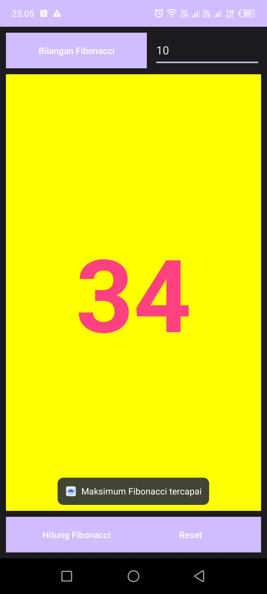

- Kasus Sianida: Aplikasi ini dapat memberikan informasi berita Kasus Sianida.
  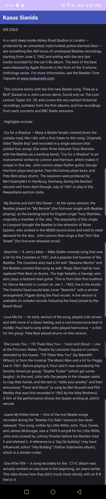

- Two Activity: Aplikasi ini merupakan berbentuk pesan yang bisa berpindah dari activity satu ke activity kedua.
  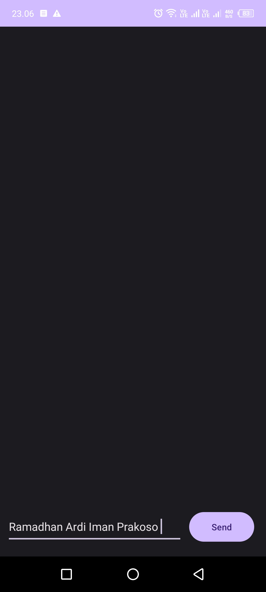
  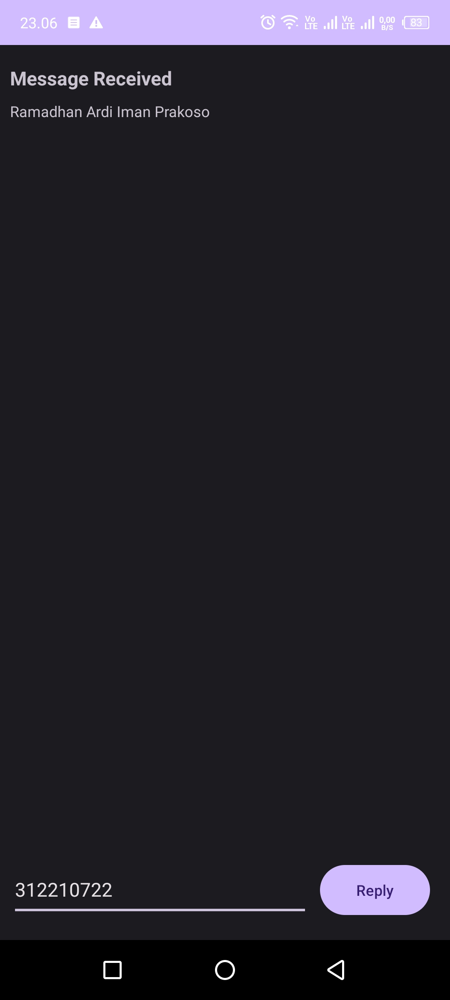

- Set Alarm: Aplikasi ini dapat mengatur alarm secara otomatis.
  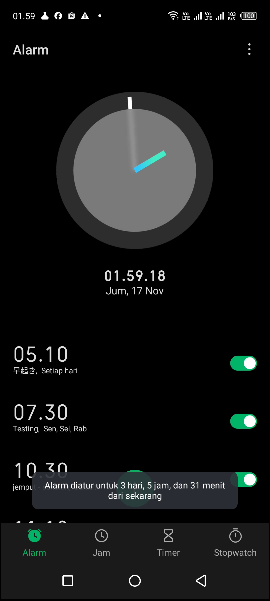

- Show Maps: Aplikasi ini dapat memberikan tujuan peta yang sudah kita tentukan.
  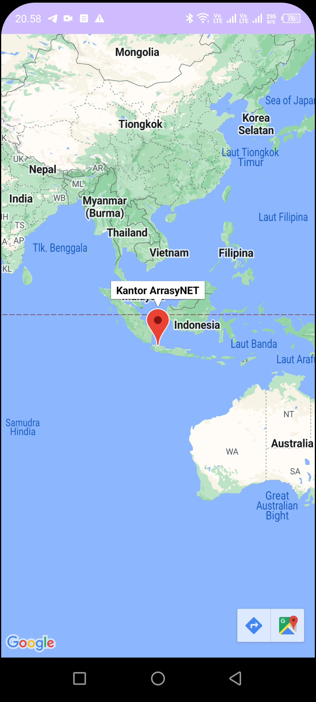
  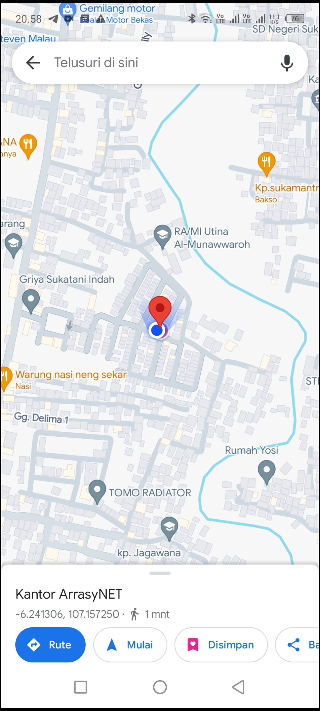

- Fragment: Aplikasi ini dapat memberikan informasi, seperti pemasangan wifi, pemasangan cctv, service komputer/laptop.
  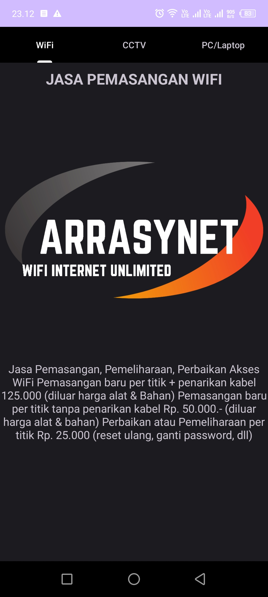
  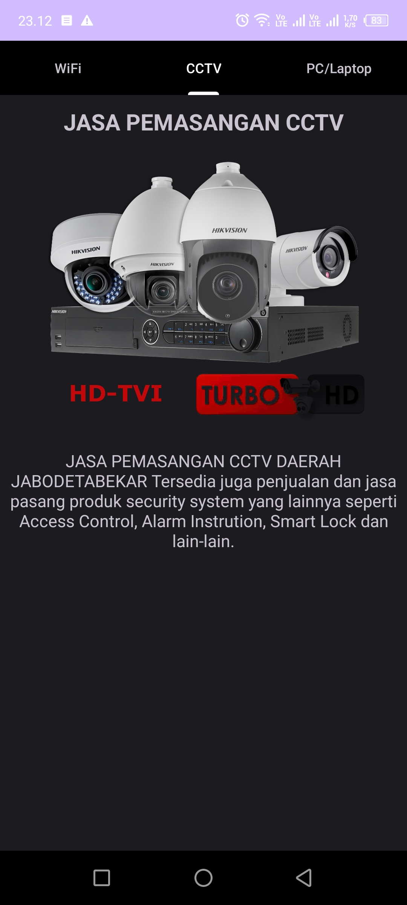
  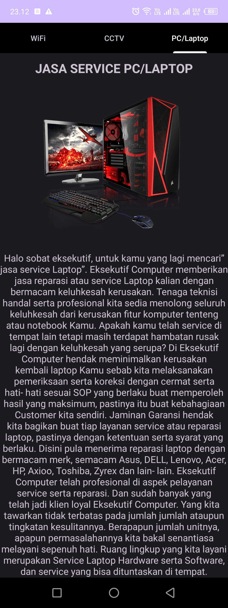

**Sekian dan Terima Kasih ;)**
